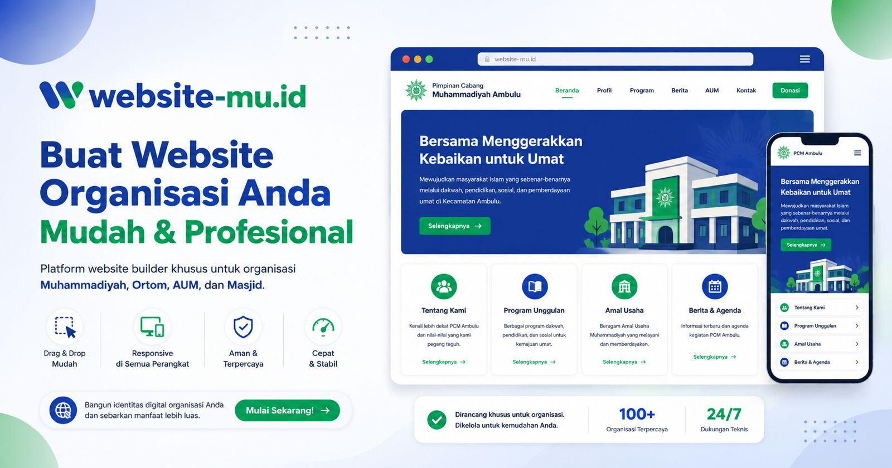

  

<h1 align="center">Website-mu</h1>

  <em>Setiap organisasi Muhammadiyah memiliki kehadiran digital yang profesional, mudah dikelola, dan saling terhubung.</em>

## Visi

Organisasi di ekosistem Muhammadiyah — Pimpinan Daerah/Cabang/Ranting, Ortom seperti Aisyiyah, Pemuda Muhammadiyah, IPM, dan IMM, Amal Usaha (sekolah, klinik, rumah sakit), hingga masjid dan mushola — sama-sama butuh kehadiran digital, tetapi sering terganjal hal yang sama: tidak punya tenaga teknis untuk membangun dan merawat website, sementara membuatnya sendiri lewat jasa desainer/developer memakan biaya dan waktu yang tidak sedikit. Akibatnya banyak unit berhenti di media sosial saja, padahal butuh identitas resmi yang lebih dari itu.

**Website-mu** menjawab ini sebagai platform *no-code* khusus untuk ekosistem Muhammadiyah. Pengurus, sekretaris, atau tim media — tanpa latar belakang pengembangan web — cukup memilih jenis organisasinya, memilih template yang sudah dirancang sesuai karakter organisasi tersebut, menyusun halaman dengan menyusun *section* siap pakai, mengisi konten lewat CMS yang sederhana, lalu menerbitkannya. Tidak perlu memikirkan hosting, domain, atau kode.

Setiap jenis organisasi punya kebutuhan komunikasi yang berbeda, jadi Website-mu tidak menyodorkan satu template generik untuk semua: template Ortom menonjolkan citra dan ajakan menjadi anggota baru dengan warna identitas masing-masing, template AUM menonjolkan layanan dan program, template masjid menonjolkan jadwal salat, kajian, dan donasi. Ke depan, platform ini juga diarahkan untuk saling menghubungkan organisasi-organisasi ini — sehingga bukan sekadar kumpulan website individual, tetapi jejaring digital Persyarikatan yang koheren.

## Yang sudah bisa dilakukan

- **Daftar & buat organisasi** — beberapa pengguna bisa mengelola satu organisasi bersama, dengan peran Owner dan Editor.
- **Pilih jenis organisasi & template** — 12 jenis organisasi dalam 3 kategori (Persyarikatan, Ortom, AUM), masing-masing dengan template dan warna identitas sendiri; bisa dipratinjau tanpa login dan diganti kapan saja.
- **Susun halaman lewat page builder** — tambah, hapus, duplikasi, dan urutkan section (profil, sambutan ketua, struktur pengurus, program unggulan, jadwal salat, PPDB, donasi, dan lainnya) tanpa menyentuh kode.
- **Kelola konten lewat CMS** — berita, agenda, pengumuman, pengurus, program, galeri foto — semua lewat form sederhana.
- **Atur identitas brand** — warna, logo, dan font organisasi, konsisten di seluruh halaman.
- **Terbitkan ke subdomain publik** — situs organisasi langsung bisa diakses di `{nama-organisasi}.website-mu.id`, lengkap dengan SEO dan sitemap otomatis.
- **Pilih paket langganan** sesuai kebutuhan, dengan proses upgrade dan pembayaran yang jelas.

## Dokumen referensi

- [`prd.md`](prd.md) — product brief lengkap: visi produk, latar belakang masalah, target pengguna, dan arah pengembangan jangka panjang.
- [`prd-status.md`](prd-status.md) — snapshot status pembangunan aktual dibanding visi di `prd.md`.

### Setup untuk developer

Panduan menjalankan proyek secara lokal (instalasi dependency, environment, dan perintah pengembangan) ada di [`CLAUDE.md`](CLAUDE.md).
